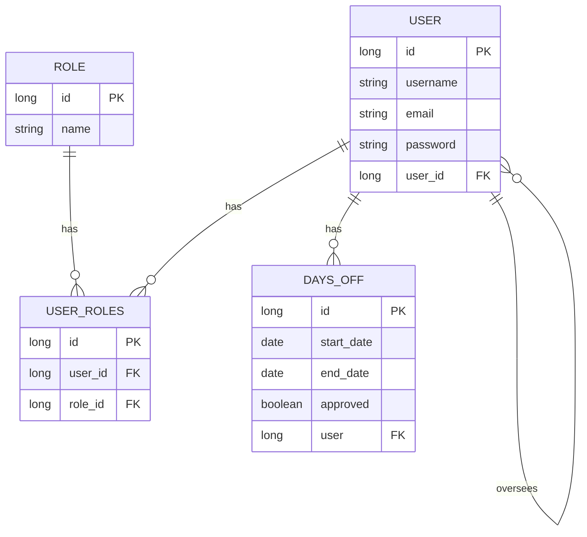

## Notițe Proiect:
Utilizatorii:
se autentifica - stiu cine este
se autorizeaza - stiu ce drepturi are

Cerinte functionale:
1. Gestiunea autentificarii + autentificarii
Sign In/Sign up, logare prin cod de autentificare, logare prin card etc.
2. Solicitarea de concediu + View asupra zilelor de concediu
3. Aprobarea/Respingerea concediului + Definirea si modificarea numarului zilelor de concediu/angajat
4. Stabilirea numarului de zile de concediu
5. Stabilirea sefilor

Cereri nonfunctionale:
Sarbatorile legale pot fi hard-codate

Identificarea actorilor + actiunilor lor:
Administrator (practic, face toate actiunile, are toate drepturile: 1, 2, 3, 4, 5)
Autentificare + Autorizare
Cere concediu
Stabileste sefii ierarhici
Stabileste numarul de zile de concediu
Isi aproba singur concediul
Ar putea lasa delegati pentru aprobarea de concedii atunci cand un sef este in concediu
Seful ierarhic (1, 2, 3, 4)
Autentificare + Autorizare
Cere concediu
Stabileste cate zile de concediu are un angajat
Aproba si respinge concedii
Defineste si modifica numarul de zile de concediu/an/angajat
Angajatul (1, 2)
Autentificare + Autorizare
Cere concediu
Vede un raport al zilelor de concediu (probabil tabelar)

Baza de date:

-------------------------------------------------------------------------------------------------------------------------------------------
Obs.:
1. Adminul poate avea sef si poate fi la randul sau sef. Important este sa aiba token-ul de admin pentru a putea realiza toate actiunile.
2. Pe Frontend, sa existe consistenta a layout-ului, sa se tina cont de UX (Partea de UI, mai putin importanta: responsive, estetica etc.)

-------------------------------------------------------------------------------------------------------------------------------------------
